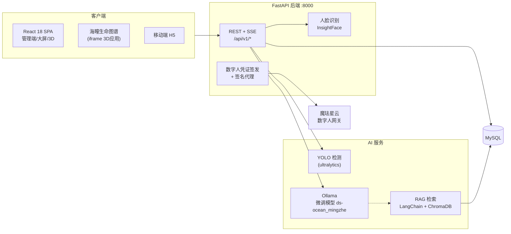

# 海洋守护者 AquaRise — 水下垃圾自动识别与海洋污染分析系统

> **Underwater Debris Recognition & Marine Pollution Analysis System**
> 第8组 · 8周企业实训项目（已结项验收） ·猿舟 GitLab + GitHub 镜像

**English Abstract.** *AquaRise* is a full-stack platform for underwater litter monitoring and marine pollution analysis. It combines a fine-tuned YOLO object detector (22 classes, trained on TrashCan 1.0) with a FastAPI service, a React 18 SPA with ECharts dashboards and an interactive 3D ocean scene, a local LLM assistant (LoRA fine-tuned model served by Ollama, enhanced by a LangChain + ChromaDB RAG pipeline), an embodied digital-human presenter (Xmov SDK with server-side short-lived credentials), JWT/RBAC account system with face login, and a mobile H5 companion. Detection records are stored in MySQL for trend analysis, area assessment and automatic report generation.

---

## 功能特性

- **水下垃圾检测**：图片/视频上传 → YOLO 模型推理 → Canvas 标注框渲染 → 检测记录落库；上传前水色判据校验，拦截非海底素材
- **统计分析与大屏**：ECharts 趋势/占比/海域聚合图表，指挥决策大屏，30 秒自动刷新（页面隐藏时暂停）
- **海洋 3D 态势**：three.js 3D 地球 + 三标准监测站声呐网络，监测/科普双模式（按用户组授权）
- **海瞳生命图谱**：独立 3D 生命图谱应用（iframe 集成）——物种档案、GBIF 观测分布地图、MediaPipe 手势导览、海洋声景
- **LLM 海洋助手**：Ollama 本地部署微调模型 + RAG 知识库增强 + SSE 流式输出 + 证据引用门禁；切页不中断在途对话
- **数字人播报**：魔珐星云 3D 数字人，服务端签发 5 分钟短期凭证 + 签名代理转发，平台长期密钥不出服务端
- **检测报告**：按海域/时间聚合自动生成 HTML 分析报告，支持导入结构化分析
- **账号与权限（RBAC）**：JWT（HttpOnly Cookie + Bearer 双通道）、图形验证码、人脸识别登录、保持登录；功能模块 → 用户组 → 用户三级授权，内置 4 组，超管后台管理用户/用户组/换组审批
- **移动端观察端**：原生 JS H5，登录/监测/历史/个人中心，与 PC 端互不挤占会话

## 系统架构



## 技术栈

| 层级 | 技术 | 说明 |
|------|------|------|
| 深度学习框架 | PyTorch | 模型训练底层框架 |
| 视觉模型 | YOLO11 (ultralytics) + OpenCV | 22 类水下垃圾目标检测、图像/视频处理 |
| 后端 | FastAPI + SQLAlchemy + PyJWT | 单服务（端口 8000），REST + SSE |
| 数据库 | MySQL（结构化）+ ChromaDB（向量） | 检测记录 / 会话 / 报告 + RAG 知识库 |
| 前端 | React 18 + TypeScript + Vite 6 + ECharts 5 + three.js + Marked + DOMPurify | 管理端 SPA + 数据大屏 + 3D 态势 + 流式 Markdown 安全渲染 |
| LLM 微调 | LoRA/PEFT (transformers) | Qwen2-0.5B 海洋领域微调 → GGUF |
| LLM 部署 | Ollama（本地） | 模型私有化部署，回滚基线 deepseek-r1:1.5b |
| LLM 应用 | LangChain + ChromaDB + BGE 中文嵌入 | 检索增强生成 |
| 人脸识别 | InsightFace (buffalo_l) + ONNX Runtime | 检测+对齐+512 维嵌入比对 |
| 数字人 | 魔珐星云 XmovAvatar JS SDK | 浏览器端渲染 + 服务端短期凭证签名代理 |
| 移动端 | 原生 JS H5 | 观察端，无构建依赖 |

## 目录结构

```
issedu_ysu2026_7439/
├── src/
│   ├── vision/          # YOLO 训练/推理/视频处理与数据集构建脚本
│   ├── LLM/             # LoRA 微调、GGUF 转换、RAG、数字人对接
│   ├── backend/         # FastAPI：main.py + routers/ + services/
│   ├── frontend/        # React SPA（public/haitong/ 为生命图谱独立应用）
│   └── mobile/          # 移动端 H5
├── data/knowledge/      # RAG 知识库文档（随仓库分发）
├── dataset/             # TrashCan 数据集（不入库，本地存放）
├── models/              # 模型权重（不入库）
├── tests/               # pytest / vitest 测试
└── doc/                 # 实训过程文档（01 需求 … 12 自检）
```

## 快速开始

### 环境要求

- Windows / Linux，Python 3.10+，Node.js 18+（仅前端构建需要）
- MySQL 8.x（本机服务即可，数据库首次启动自动创建）
- Ollama（LLM 对话与数字人需要；不装则相关功能降级）

### 1. 后端

```bash
# Python 环境
conda create -n underwater python=3.10
conda activate underwater
pip install -r requirements.txt

# 配置：复制模板并按需修改
cp .env.example .env

# 启动（端口 8000，自动建库建表、播种内置用户组与 admin 账号）
uvicorn src.backend.main:app --reload --port 8000
```

首次启动自动创建演示管理员 **admin / 123456**（生产部署必须立即修改，见下方安全说明）。

### 2. 前端

```bash
cd src/frontend
npm install
npm run dev        # http://localhost:5173 ，/api 代理到 8000
npm run build      # 生产构建 → dist/
npm test           # Vitest 单元测试
```

Windows 可直接双击仓库根目录 `启动项目.bat`（首次运行自动执行 `npm install`）。

### 3. LLM 与数字人（可选）

```bash
ollama serve
# 有微调模型则导入；否则可先拉回滚基线体验
ollama pull deepseek-r1:1.5b
```

数字人功能需在魔珐星云控制台创建应用，将 `DH_APP_ID` / `DH_APP_SECRET` 填入项目根目录 `.env`；未配置时前端自动降级为纯文本 + 浏览器语音模式。

### 4. 后端测试

```bash
pytest tests/ -v
```

## 环境变量（.env）

| 变量 | 说明 | 默认 |
|------|------|------|
| `DB_HOST/DB_PORT/DB_USER/DB_PASSWORD/DB_NAME` | MySQL 连接 | localhost:3306 / root / fastapi_login |
| `JWT_SECRET_KEY` | JWT 签名密钥 | 开发默认值，**部署必须替换** |
| `CAPTCHA_SECRET_KEY` | 验证码签名密钥 | 开发默认值，**部署必须替换** |
| `OLLAMA_URL` / `OLLAMA_MODEL` | Ollama 地址与模型 | localhost:11434 / ds-ocean_mingzhe |
| `RAG_ENABLED` / `RAG_TOP_K` | RAG 开关与召回数 | true / 5 |
| `DH_APP_ID` / `DH_APP_SECRET` | 数字人平台凭证（只放服务端 .env） | 空（未配置则降级） |
| `YOLO_MODEL_PATH` / `YOLO_CONF` | 检测模型路径与置信度阈值 | src/vision/best.pt / 0.25 |
| `FACE_EMBEDDING_THRESHOLD` | 人脸比对距离阈值 | 0.5 |

完整清单见 [.env.example](.env.example)。

## 安全说明

- 所有密钥（JWT/验证码签名密钥、数据库密码、数字人 appSecret）一律通过服务端 `.env` 注入，**不写入代码、前端或仓库**；前端仅持有后端签发的 5 分钟短期凭证
- 上线前必做：修改 `admin` 默认密码，替换 `JWT_SECRET_KEY` / `CAPTCHA_SECRET_KEY` / `DB_PASSWORD` 为随机长字符串
- 密码使用 bcrypt 哈希存储；JWT 支持 HttpOnly Cookie 与 Bearer 双通道

## 数据集

项目基于 **[TrashCan 1.0](https://github.com/SeaAlien/TrashCan)**（水下垃圾实例分割数据集），已完成 COCO → YOLO 格式转换：

| 属性 | 值 |
|------|-----|
| 总图片 / 标注框 | 7,212 张 / 12,128 框 |
| 类别 | 22 类（14 垃圾目标 + 8 水下生物/设备背景类） |
| 划分 | Train 5,048 / Val 1,442 / Test 722 |

数据集体积较大，**不随仓库分发**：请从上游获取后放入 `dataset/`，转换脚本与处理记录见 `dataset/convert_coco_to_yolo.py` 与 `dataset/数据集处理进度报告.md`（本地）。已知类别不均衡：`trash_unknown_instance` 占比约 45.9%，训练需类别加权。

## 项目文档

实训全流程文档（需求、设计、测试用例、检视、问题列表、会议记录、迭代计划等）见 [`doc/`](doc/)，按实训规范 01–12 目录组织；项目规划与 Git 协作规范见 `doc/10.计划书/`。

## 团队

第8组 · 5 人：视觉模型工程师 / LLM工程师 / 后端工程师 / 前端工程师 / 测试工程师（详细分工见 `doc/10.计划书/项目规划文档.md` 第八章）。

## 致谢

- [TrashCan 1.0](https://github.com/SeaAlien/TrashCan) — 水下垃圾检测数据集
- [Ultralytics YOLO](https://github.com/ultralytics/ultralytics) · [FastAPI](https://fastapi.tiangolo.com/) · [Ollama](https://ollama.com/) · [LangChain](https://www.langchain.com/) · [ECharts](https://echarts.apache.org/) · [three.js](https://threejs.org/) · [魔珐星云](https://www.xingyun3d.com/)
