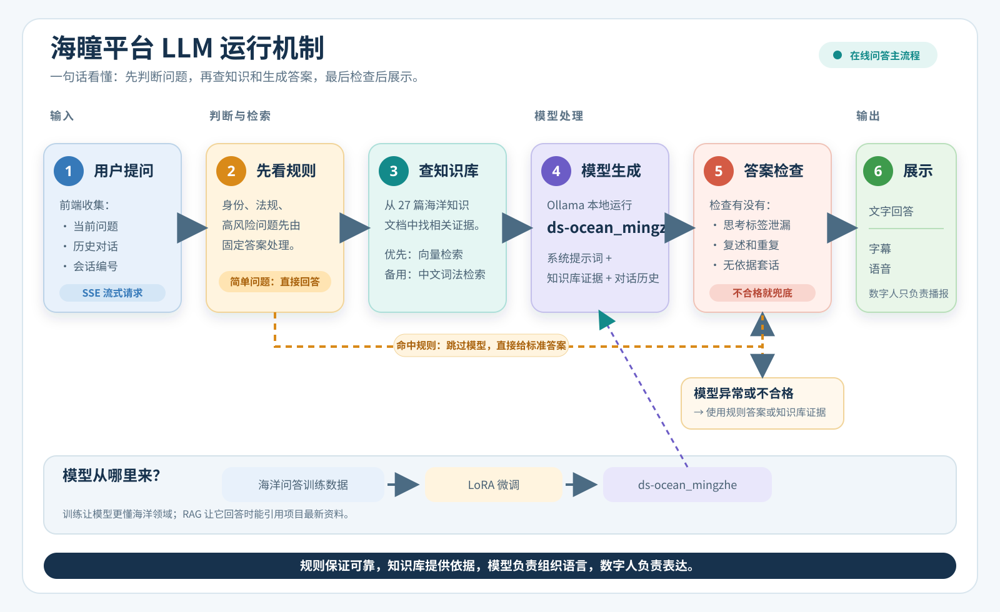
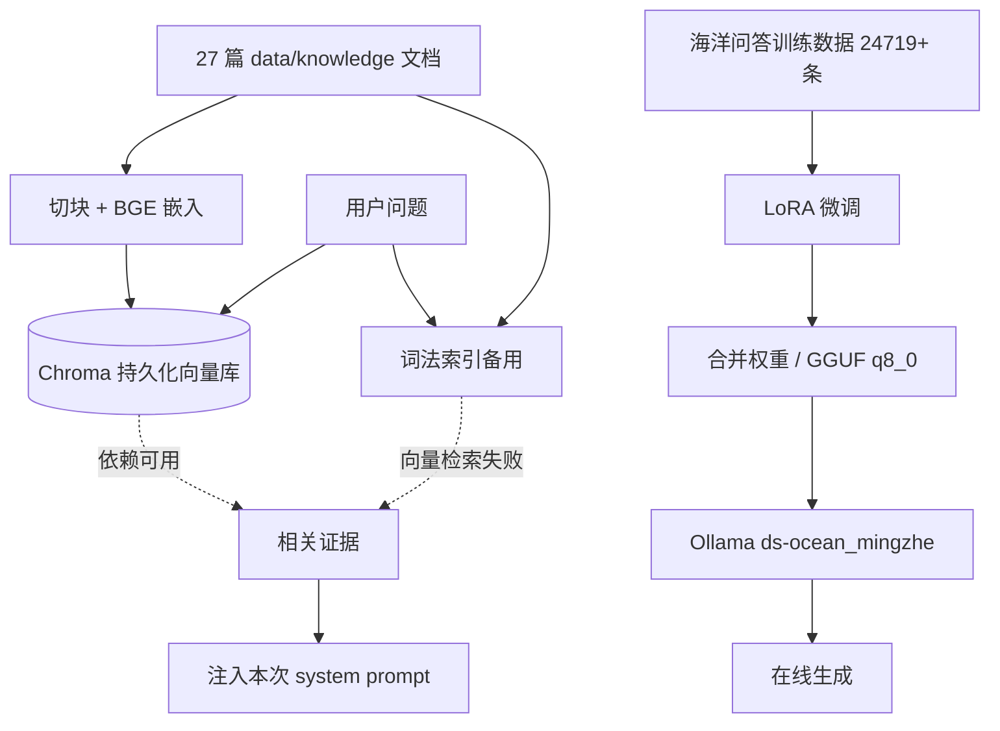
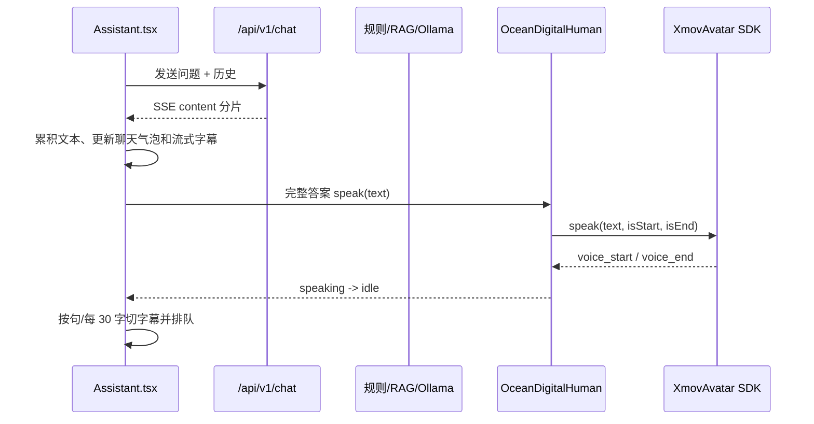

# LLM 运行机制说明

> 更新日期：2026-08-15  
> 适用范围：海瞳平台在线问答、RAG 知识库、Ollama 推理和数字人播报。

## 先看简明图



这张图面向汇报展示，重点只保留“规则判断、知识库、模型、答案检查、数字人输出”五个概念；下面的 Mermaid 图和文字说明用于需要继续追代码时的细节核对。

## 0. 对附图的理解

用户附图是项目管理系统中的 Story/需求清单（例如 SSE 流式对话路由、回答质量门禁、知识库证据兜底、LoRA 微调等），不是需要被执行的代码指令。下面的说明以当前仓库代码为准。

## 1. 一张图看懂在线运行链路

```mermaid
flowchart LR
    U[用户提问] --> A[前端 Assistant.tsx<br/>组装会话历史]
    A --> B[POST /api/v1/chat<br/>SSE 流式请求]
    B --> C[JWT 校验<br/>抽取最后一个 user 消息]
    C --> D[写入 ChatHistory<br/>保存用户问题]
    D --> E{确定性直答命中?}

    E -->|是| R[规则回答 direct_response<br/>身份/寒暄/越界/高风险常识/高频领域题]
    E -->|否| F[ChatService.build_messages]

    F --> G[系统提示词<br/>范围、安全边界、回答格式]
    F --> H{RAG 开启?}
    H -->|是| I[检索知识库]
    H -->|否| J[仅使用会话上下文]
    I --> K{向量检索可用?}
    K -->|是| L[Chroma + BGE-small-zh<br/>相似度 Top-K 证据]
    K -->|否| M[本地中文词法检索<br/>LocalKnowledgeRetriever]
    L --> N[证据作为 system 消息注入]
    M --> N
    N --> O[Ollama /api/chat<br/>模型 ds-ocean_mingzhe<br/>低温度、think=false]
    J --> O
    O --> P[流式模型输出]
    P --> Q[chat_router 缓冲完整答案]
    Q --> S{质量门禁通过?}
    S -->|通过| T[过滤 think 标签<br/>短句切分后输出]
    S -->|拒绝/服务异常| V[规则或知识库证据兜底<br/>finalize_model_answer]
    R --> T
    V --> T
    T --> W[SSE data: {content}<br/>前端逐块渲染]
    W --> X[保存 assistant ChatHistory]
    W --> Y[聊天气泡 + 数字人字幕/语音]

    style O fill:#0b7285,color:#fff,stroke:#075985
    style I fill:#2f9e44,color:#fff,stroke:#1b7f32
    style S fill:#f08c00,color:#fff,stroke:#c25b00
    style Y fill:#7048e8,color:#fff,stroke:#5f3dc4
```

### 1.1 请求进入后端

`Assistant.tsx` 将当前问题、历史消息和 `session_id` 交给 `streamChat()`，请求 `POST /api/v1/chat`。后端先验证登录用户，提取最后一条用户消息，把用户消息写入 `ChatHistory`，然后启动异步 SSE 事件流。

### 1.2 为什么先走确定性规则

`src/backend/services/llm.py` 的 `direct_response()` 处理身份介绍、寒暄、越界问题、低置信度检测、幽灵渔网、微塑料、MARPOL 和清理方案等高风险或高频问题。这样可以避免 1.5B 级模型在项目身份、法规禁令和检测结论上自由发挥。命中规则时，不经过 Ollama，直接按短句流式返回。

### 1.3 RAG 是怎样接入模型的

未命中规则时，`ChatService.build_messages()` 先建立服务端 system prompt，再根据最后一个用户问题检索证据：

- 首选 `Chroma` 向量库，使用 `BAAI/bge-small-zh-v1.5` 嵌入；知识文档按 650 字符切块、重叠 80 字符。
- 如果 Chroma 或嵌入依赖不可用，自动切到 `LocalKnowledgeRetriever` 中文词法检索，保证无网络/缺依赖时仍能工作。
- 检索结果被作为另一条 `system` 消息注入，并明确要求模型只使用证据相关内容；默认在线对话取 `RAG_TOP_K`（默认 3）条。

因此 RAG 不是重新训练模型，而是“先查项目知识，再把证据放进本次提示词”。

### 1.4 Ollama 推理和质量门禁

Ollama 在本地 `/api/chat` 提供 `ds-ocean_mingzhe` 推理服务。请求使用较低温度（默认 0.2）、`num_predict`（默认 1024）、`repeat_penalty=1.12`、`top_p=0.9`，并关闭 `think`。模型输出先在后端缓冲，不直接把未经检查的半句发给浏览器。

质量门禁会清理 `<think>` 标签，并拦截空答案、复述问题、明显重复、无依据套话和与问题主题不匹配的回答。通过后才按短句重新流式发送；不通过则调用规则回答或从本地知识库返回带来源的证据兜底。

## 2. 知识库和微调分别做什么



- **RAG** 解决“本项目有哪些可引用事实”，知识可以通过文档更新和增量向量化加入。
- **LoRA/合并模型**解决“模型应以什么身份、语气和领域习惯回答”，训练产物被转换为 GGUF 后导入 Ollama。
- 在线回答是二者叠加：模型提供语言生成能力，RAG 提供当前项目证据，规则和质量门禁负责安全边界。

## 3. 数字人位于 LLM 的输出侧



数字人不参与 LLM 生成，也不负责 RAG。当前前端逻辑是：

1. 请求发送时数字人进入 `thinking`，调用 SDK 的 `think()`。
2. SSE 到达时，文本实时更新聊天气泡和当前字幕。
3. 回复结束后，按句切分、再按约 30 字切行，调用 `OceanDigitalHuman.speak()` 进行 TTS/口型播报。
4. SDK 发出 `voice_start`、`voice_end` 事件，前端同步 `speaking`、`idle` 状态。
5. 数字人未配置或服务失败时，退回全息拟态舞台；浏览器支持时还可使用 `speechSynthesis`。

需要特别注意：`src/backend/routers/digital_human_router.py` 目前只是受保护的配置存根，`Assistant.tsx` 实际直接读取 `VITE_DH_APP_ID` / `VITE_DH_APP_SECRET` 并加载魔珐星云 CDN SDK。也就是说，当前数字人主链是“前端 SDK 直连”，不是后端数字人接口参与问答。

## 4. 一句话总结

**用户问题先经过规则边界判断；需要生成时，后端把会话历史和 RAG 证据拼成提示词交给本地 Ollama 模型；输出再经过 think 清理和质量门禁，最后以 SSE 返回给前端，并由前端同时渲染文字、字幕和数字人语音。**

## 5. 关键代码位置

| 作用 | 文件 |
|---|---|
| SSE 对话路由、规则/模型分流、质量门禁接入 | `src/backend/routers/chat_router.py` |
| 确定性回答、质量门禁、知识库兜底 | `src/backend/services/llm.py` |
| Ollama 客户端、RAG 注入、流式模型调用 | `src/LLM/chat_api.py` |
| Chroma/BGE 知识库构建 | `src/LLM/rag/knowledge_base.py` |
| 向量检索与词法降级 | `src/LLM/rag/retriever.py`、`src/LLM/rag/lexical_retriever.py` |
| 前端 SSE 消费与会话历史 | `src/frontend/src/services/api.ts` |
| 前端对话状态、字幕队列、数字人触发 | `src/frontend/src/pages/Assistant.tsx` |
| XmovAvatar SDK 封装 | `src/frontend/src/services/digitalHuman.ts` |
