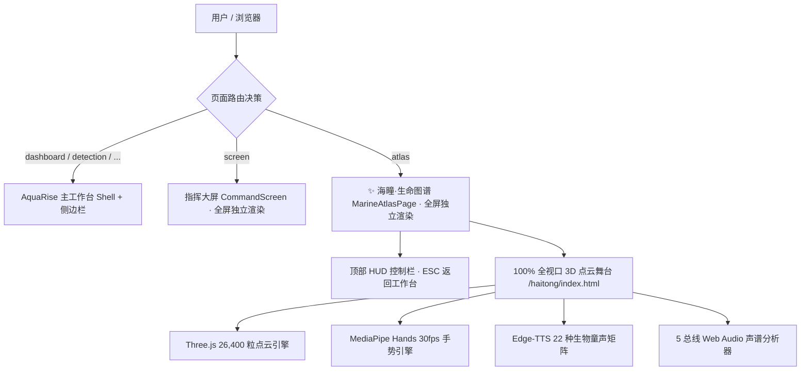

# 海瞳 · 3D粒子海洋生命图谱集成与全屏沉浸视界开发记录 (2026-08-19)

> 🌟 **项目总策划**：`mingzhe` (Executive Producer & Chief Planner)  
> ⚠️ **非商业研学声明**：本项目内置背景音乐音频《跃》（演唱：薛之谦）仅供非商业性的**个人/内部学习、教学研究与学术交流**使用，音频版权归原作者及相关唱片公司所有。未经官方版权方授权许可，严禁用于任何形式的商业盈利行为或公开发布传播。

---

## 一、集成背景与业务演进

在 **AquaRise 智慧海洋监测与生态治理综合平台** 中，已有监测中心（态势总览、智能识别、检测历史）、研判决策（污染分析、指挥大屏、质量报告）与智能服务（海洋守护者数字人问答）。

为了使整体平台更聚焦于“实时视觉识别与宏观生物多样性全息图谱”，项目总策划 **`mingzhe`** 指导推进了以下核心重构与升级：
1. **下线知识库模块**：精简侧边栏菜单，剔除过载冗余项，使智能服务直达「海洋守护者」与「海瞳 · 生命图谱」。
2. **生命图谱升级为顶级全屏沉浸视界**：点击侧边栏「海瞳 · 生命图谱」直接进入 100% 满屏全息视界（与「指挥大屏」同级独立渲染），顶部配备高端赛博 HUD 返回按钮与 ESC 一键平滑退出机制。
3. **全平台视觉徽标与 Favicon 统一**：全站统一应用海瞳官方生物荧光眼矢量徽标（`HaitongLogo.tsx` 及 `public/favicon.svg`），强化品牌整体感与科技沉浸感。

---

## 二、架构设计与工程落地



### 1. 路由与全屏视界独立渲染 (`App.tsx`)
- **独立顶层挂载**：
  ```tsx
  if (page === 'screen') return <Suspense fallback={<div className="page-state"><i className="loader-orbit" />正在载入指挥大屏…</div>}><CommandScreen onExit={() => navigate('dashboard')} /></Suspense>;
  if (page === 'atlas') return <Suspense fallback={<div className="page-state"><i className="loader-orbit" />正在载入生命图谱…</div>}><MarineAtlasPage onExit={() => navigate('dashboard')} /></Suspense>;
  ```
- **知识库下线**：从 `PageKey`、`validPages`、`Shell.tsx` 侧边栏导航列表及主页面路由中彻底移除。

### 2. 旗舰 HUD 控制与交互组件 (`MarineAtlas.tsx`)
- **左侧赛博 HUD 返回按钮**：
  - 继承与指挥大屏完全一致的高端 HUD 视觉规范（`.command-back-hud-btn`），包含返回图标、中英双语标签（`返回工作台 / EXIT TO PLATFORM`）与专属按键气泡（`ESC`）。
  - 内置全局键盘监听：按键盘 **`ESC`** 键即可毫秒级平滑切回主监控工作台。
- **中央全息品牌徽标**：集成官方 `HaitongLogo` 生物荧光眼矢量图标、脉冲光晕与 `LIVE ATLAS` 状态胶囊。
- **右侧功能工具栏**：
  - 🖐️ **手势指南速查抽屉 (`atlas-guide-drawer`)**：悬浮查看 6 大核心手势与隐藏彩蛋。
  - 🔄 **重置视角**：一键重新校准三维粒子地球。
  - ⚡ **独立窗口**：一键以独立网页运行。
  - 🪟 **原生全屏**：联动浏览器 Fullscreen API 切换 F11 真全屏。
- **主体 100% 全息舞台**：`marine-atlas-stage-container` 撑满屏幕主体，无缝加载 `public/haitong/index.html`。
- **底部遥测状态条**：实时反馈 26,400 粒子就绪状态、MediaPipe 30 FPS、总策划 `mingzhe` 署名与背景音乐非商业研学说明。

### 3. 全平台视觉图标与 Favicon 统一
- **矢量图标组件 (`HaitongLogo.tsx`)**：
  - 精确重构海瞳天体轨道环、两极电光节点、生物虹膜及生命核心高光瞳孔。
  - 在侧边栏主品牌、登录页品牌光球、指挥大屏顶栏及生命图谱顶栏全量替换应用。
- **全站 Favicon (`public/favicon.svg`)**：
  - 生成 64×64 高保真矢量 SVG 图标，配置在 `index.html` 的 `<link rel="icon">` 中。

---

## 三、核心技术亮点

### 1. 22 种生物专属童声独白矩阵 (Edge-TTS + SSML)
- 采用 **Edge-TTS + SSML 细粒度角色与音调调控**，覆盖 9 大微软 Neural 中文发音人。
- 根据儿童短声道高基频（$F_0 \approx 250\text{Hz} \sim 400\text{Hz}$）特性施加 `+45Hz ~ +92Hz` 调优，塑造出 22 种性格迥异的纯真童声（如 5 岁怯生生小头鼠海豚、8 岁空灵蓝鲸少年、7 岁活泼玳瑁小海龟等）。
- 点击「声纹回响」即时驱动**深海声呐引力波纹扩散**与**三频带粒子跳动**。

### 2. MediaPipe Hands 纯本地无感手势交互
- 浏览器内 ~30 FPS 本地检测 21 个手部三维关节点，**0 画面上传，100% 隐私安全**。
- 标准 6 大交互手势：`palm`（张开下潜显影）、`fist`（握拳重归地球）、`ok`（OK 手势固定/解锁档案）、`palm swipe`（挥掌翻页）、`one / point`（单指旋转地球）、`call`（电话"6"启停音乐）。
- 重构 **OK 手势发光全息矢量图** 与呼吸微旋动效（`.anim-ok`）。

### 3. 深海终极隐藏彩蛋「一鲸落 · 万物生」
- 移出常规列表，在地球模式下**竖大拇指 👍** 触发。
- 四幕全景演替（移动清道夫期 ➔ 机会主义者期 ➔ 化能自养期 ➔ 礁岩绿洲期）与 5 层 Web Audio 物理合成器。

### 4. 六大顶级浪漫视听特性
- **深海声呐光环波纹场**、**全球洋流生命光带**、**灭绝物种时光回溯螺旋重构**、**夜光藻触碰流光拖尾**、**极境呼吸冥想视界**、**鲸落全景演化史诗**。

### 5. 展览自动演示节奏优化
- 每轮随机精选 **3 种海洋生物** 依次展开童声自述与全息显影，随后自动触发鲸落大秀并循环往复，任意用户操作 0.1 秒内丝滑切回手动。

---

## 四、验证与构建测试

1. **前端生产构建**：
   - 执行 `npm run build`（`tsc -b && vite build`），耗时 4.49 秒，**0 错误，0 警告阻断**。
2. **多终端兼容性**：
   - 支持桌面端鼠标、键盘快捷键（ESC 退出、方向键翻页）与摄像头 AI 手势全通道自由操控。
